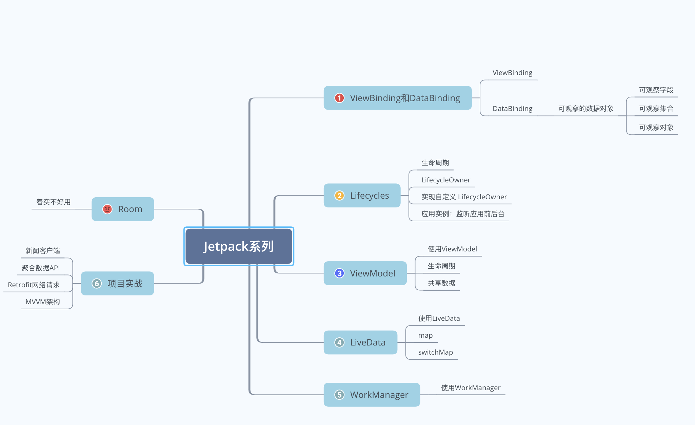
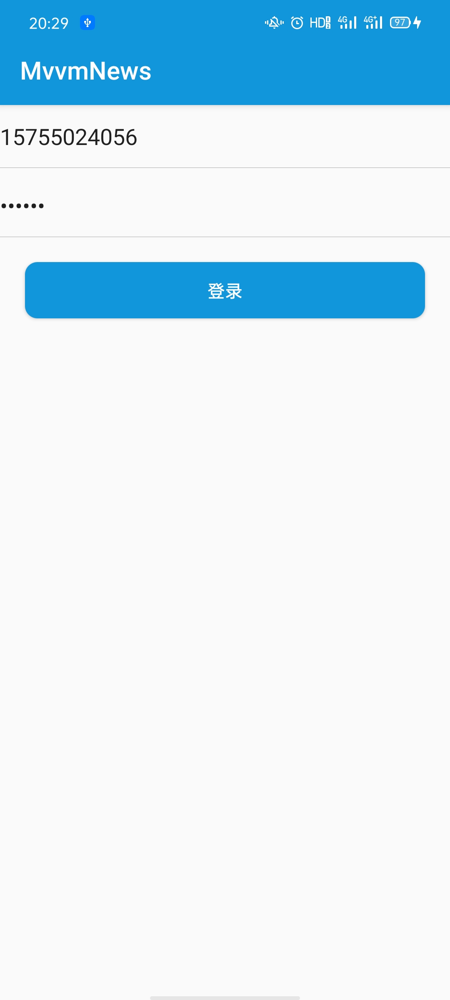
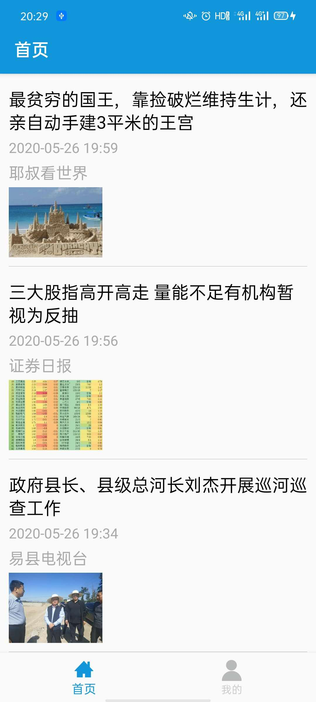
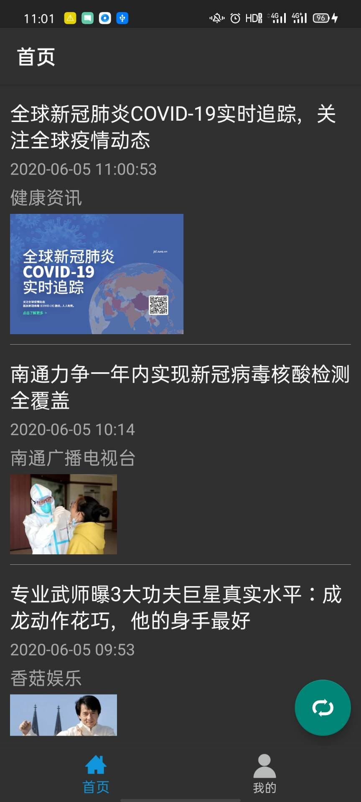

# MvvmNews
--------------------------------------------------------------------------------
2021.09.10日更新：本项目仅适用于学习Jetpack基础组件使用方式使用，现已不符合实际项目中使用方式
--------------------------------------------------------------------------------
史上最简单却又涵盖所有的MVVM、JetPack开源项目

LiveData、ViewModel、DataBinding

聚合数据 API、Retrofit网络请求打造最简易的MVVM项目

简易到 其实是个Demo

如果有帮助到你 欢迎start 有建议 欢迎Issues

配套博客：
[Android JetPack系列文章](https://huanglinqing.blog.csdn.net/article/details/106215492)




项目运行效果图如下所示：

登录账号为：15755024056 123456







# 更新日志

### 2020.06.05

<li>适配Android Q 暗黑模式</li>

一般应用都需使用 差异化编程  在values-night 配置颜色资源<br>

常规设计应用 可以使用 能够根据当前主题自动切换颜色的主题属性

如：

```
android:textColor="?android:attr/textColorPrimary"
```
暗黑模式下运行效果图如下所示：



